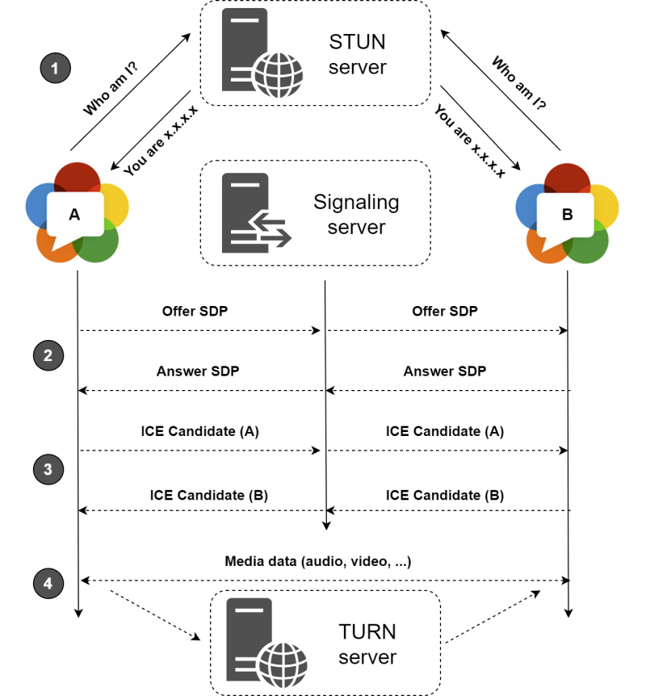

#  easy-meet


Powered by `WebRTC` using google Stun and [numb](http://numb.viagenie.ca/) Turn. `easy-meet` provides video quality and latency not available with traditional technology.

Open the app with the following **supported browsers** & many more...

[//]: #


<br>


## Features

-   Is `100% Free` and `Open Source`
-   No download, plug-in or login required, entirely browser based
-   Unlimited number of conference rooms without call time limitation
-   Possibility to Lock/Unlock the Room for the meeting
-   Desktop and Mobile compatible
-   Optimized Room URL Sharing (share it to your participants, wait them to join)
-   Webcam Streaming (Front - Rear for mobile)
-   Audio Streaming crystal clear
-   Screen Sharing to present documents, slides, and more...
-   File Sharing, share any files to your participants in the room
-   Select Audio Input - Output && Video source
-   Ability to set video quality up to 4K and adapt the FPS
-   Recording your Screen, Audio and Video
-   Chat with Emoji Picker & Private messages & Save the conversations
-   Simple collaborative whiteboard for the teachers
-   Share any YouTube video in real time
-   Full Screen Mode on mouse click on the Video element
-   Possibility to Change UI Themes
-   Right-click on the Video elements for more options
-   Direct `peer-to-peer` connection ensures the lowest latency thanks to `WebRTC`
-   Supports [REST API](api/README.md) (Application Programming Interface)


## Quick start

-   You will need to have `Node.js` installed, this project has been tested with Node version [12.X](https://nodejs.org/en/blog/release/v12.22.1/) and [14.X](https://nodejs.org/en/blog/release/v14.17.5/)

```bash
# clone this repo
$ git clone https://github.com/andrewkezy/easy-meet.git
# go to easy-meet dir
$ cd easy-meet
# copy .env.template to .env
$ cp .env.template .env
# install dependencies
$ npm install
# start the server
$ npm start
```

-   Open http://localhost:3000 in browser

---

## Docker

-   Install https://docs.docker.com/compose/install/

```bash
# copy .env.template to .env
$ cp .env.template .env
# build or rebuild services
$ docker-compose build
# create and start containers
$ docker-compose up # -d
# stop and remove resources
$ docker-compose down
```

-   Open http://localhost:3000 in browser

---


If you want `Easy-meet` to be `reachable` from the `outside` of your local network, you can use a service like [ngrok](https://ngrok.com/) (by editing the `Ngrok` part on `.env` file) or expose it directly on [https](ssl/README.md) or deploy it on:

<br>


